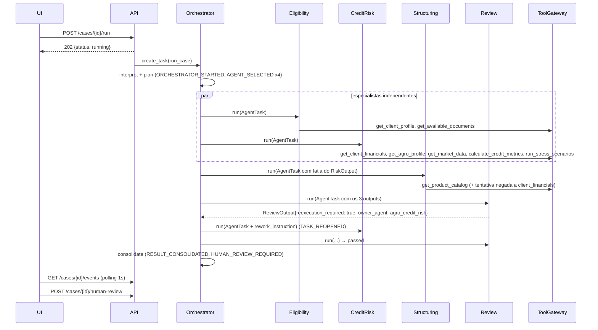
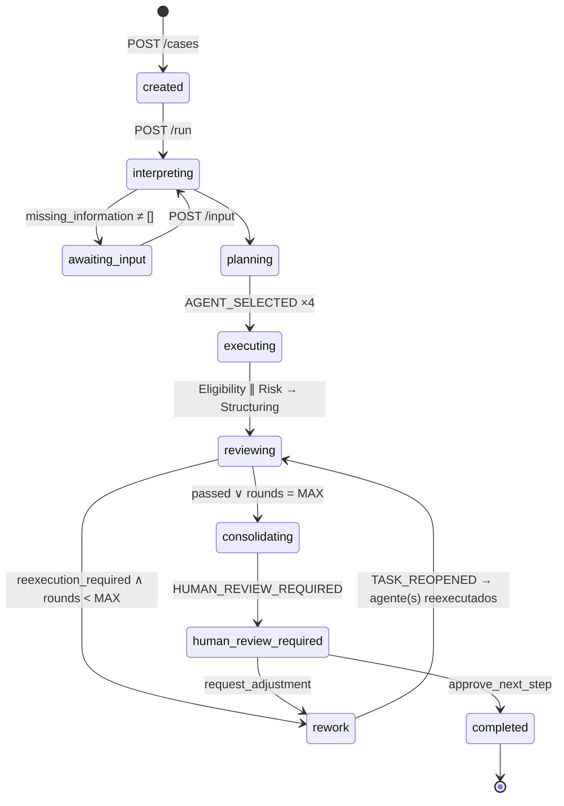

# ARCHITECTURE.md — Itaú-Native Agent Squads (MVP Crédito Agro)

> Documento de arquitetura do MVP para o Hackathon Itaú 2026. Complementa o `README.md` (especificação funcional) e é a referência obrigatória para `TECH_STACK.md` e `TASKS.md`.
>
> **Princípio norteador:** um único backend, um único frontend, zero infraestrutura além do LLM. Tudo o que puder ser determinístico será código, não prompt.

---

## 0. Decisões de arquitetura em uma página

| Pergunta | Decisão |
|---|---|
| Quantos serviços? | **Dois processos em dev** (FastAPI + Vite) e **um deploy** (FastAPI serve o build estático do frontend). Sem microserviços, sem fila, sem banco externo. |
| Como os agentes se comunicam? | **Não conversam entre si.** O Orquestrador chama cada agente como função Python (`async def run(task) -> Output`), passando um `AgentTask` com contexto fatiado e recebendo um output Pydantic. O estado compartilhado é o `CaseState` (blackboard) que só o Orquestrador escreve. |
| Como simulamos permissões? | `PolicyEngine.authorize(user, agent, resource, purpose)` determinístico = **interseção** de três listas estáticas (usuário ∩ agente ∩ propósito). Toda tool passa obrigatoriamente pelo `ToolGateway`, que autoriza, audita e carimba `source_id`. O LLM nunca vê o `PolicyEngine`. |
| Como armazenamos contexto? | `CaseState` em memória (dict por `case_id`) com snapshot JSON em disco. Quatro níveis de conhecimento (global / área / caso / squad) mapeados em arquivos estáticos + `CaseState`. |
| Como rastreamos fontes? | Todo retorno de tool é um `ToolResult{source_id, tool, resource, data}`; o `SourceRegistry` do caso indexa cada `source_id`; agentes só podem citar `evidence_ids` que receberam — validação em código rejeita IDs inventados. |
| Como o LLM é usado? | Somente para **interpretação, redação de racional e detecção de inconsistências qualitativas**. Cálculos, permissões, seleção do agente responsável pelo rework e o gate humano são código. `DEMO_MODE` troca o provider por um `MockLLMProvider` determinístico. |
| Como o usuário percorre a jornada? | 3 telas + 1 painel: Demanda → Squad em execução (timeline por eventos, polling 1s) → Resultado consolidado + Human Gate. |
| Menor MVP demonstrável? | Seção 9. Um "vertical slice" que roda ponta a ponta com `MockLLMProvider` no fim do primeiro bloco de trabalho. |

---

## 1. Visão geral dos componentes

```text
┌───────────────────────── FRONTEND (React SPA) ─────────────────────────┐
│ CaseInput → SquadTimeline + AgentCards + GovernancePanel → ResultPanel │
│                                          + EvidencePanel + HumanGate   │
└──────────────────────────────┬─────────────────────────────────────────┘
                               │ HTTP/JSON (REST + polling de eventos)
┌──────────────────────────────▼─────────────────────────────────────────┐
│                       BACKEND (FastAPI, 1 processo)                    │
│                                                                        │
│  api/            cases.py  (create, run, get, events, input, review)   │
│                  registry.py (GET /api/agents — Agent Registry)        │
│                                                                        │
│  orchestration/  Orchestrator ── Planner ── Executor ── Consolidator   │
│                        │ escreve                                       │
│                        ▼                                               │
│  state/          CaseState (blackboard) + EventLog + SourceRegistry    │
│                        ▲ lê fatias                                     │
│  agents/         Eligibility │ CreditRisk │ Structuring │ Review       │
│                        │ chama tools via                               │
│  governance/     ToolGateway → PolicyEngine → AuditLog                 │
│                        │ autorizado                                    │
│  tools/          financials │ agro │ market │ catalog │ knowledge │ calc│
│                        │ lê                                            │
│  data/ + knowledge/   JSON mock (Nível 3) + Markdown chunks (Nível 1-2)│
│                                                                        │
│  services/       LLMProvider (OpenAI-compat | Anthropic | Mock)        │
│                  Telemetry (tokens, latência por agente)               │
└────────────────────────────────────────────────────────────────────────┘
```

### 1.1 Componentes e responsabilidades

| Componente | Responsabilidade | Não faz |
|---|---|---|
| **API** | Expor os 6 endpoints do README §49 + `GET /api/agents`. Dispara `run` como `asyncio.create_task`. | Lógica de negócio. |
| **Orchestrator** | Interpretar demanda, detectar missing info, montar plano, executar especialistas em paralelo, rodar Review, decidir rework, consolidar, abrir Human Gate. | Chamar tools de dados diretamente; aprovar crédito. |
| **Planner** (parte do Orchestrator) | `interpret(prompt) -> Intent` (LLM ou regex em DEMO_MODE) e `plan(intent, registry) -> ExecutionPlan`. | Inventar agentes fora do Registry. |
| **Executor** | `asyncio.gather` dos especialistas independentes; sequencial quando há dependência (Structuring depende de Risk). Emite eventos `AGENT_STARTED/COMPLETED`. | Decidir o que rodar. |
| **Agents (4)** | Cada um: `AgentCard` + playbook + `build_context()` + `run()` + `validate()`. Devolve Pydantic. | Acessar dados sem passar pelo `ToolGateway`. |
| **ToolGateway** | Ponto único de entrada para tools: autoriza, emite `PERMISSION_CHECKED` e `TOOL_CALLED`, registra `source_id`. | Ser contornável (agentes não importam `tools/` diretamente). |
| **PolicyEngine** | `authorize()` determinístico. | Consultar LLM. |
| **CaseStore / CaseState** | Estado do caso, eventos, outputs, fontes. Snapshot JSON. | Persistência multi-instância. |
| **LLMProvider** | `complete_json(system, user, schema, model_tier)`. Implementações: `OpenAICompatProvider`, `AnthropicProvider`, `MockLLMProvider`. | Lógica de negócio. |
| **Frontend** | Renderizar timeline a partir de eventos, cards, badges de governança, evidências, Human Gate. | Calcular nada; só reflete o backend. |

---

## 2. Como os agentes se comunicam

**Modelo: orquestração centralizada + blackboard. Agentes não trocam mensagens entre si.**



### 2.1 Contrato de um agente

```python
class AgentTask(BaseModel):
    task_id: str
    case_id: str
    agent_id: str
    instruction: str                 # o que fazer nesta rodada
    context: dict                    # FATIA do CaseState (nunca o estado inteiro)
    user_context: UserContext        # identidade propagada (README §15)
    rework: ReworkInstruction | None # preenchido só em reexecução

class BaseAgent:
    card: AgentCard                  # do Registry (tools, domínios, forbidden_actions)
    def build_context(self, state: CaseState) -> dict: ...   # fatiamento
    async def run(self, task: AgentTask, gw: ToolGateway, llm: LLMProvider) -> AgentOutput: ...
    def validate(self, output: AgentOutput, sources_seen: set[str]) -> None: ...
```

Regras:
1. **Entrada mínima:** `build_context` seleciona só os campos necessários (ex.: Structuring recebe `risk_summary`, `repayment_capacity`, `main_risks`, `requested_amount` — não o `RiskOutput` inteiro).
2. **Saída estruturada:** Pydantic com `evidence_ids: list[str]` obrigatório. Sem texto livre entre agentes.
3. **Validação em código:** `evidence_ids ⊆ sources_seen`; nenhum output pode conter campos como `approved`. Falha de validação = 1 retry; segunda falha = erro visível na timeline.
4. **Rework:** a reexecução recebe `ReworkInstruction{issue_code, required_action, hint}` e o output anterior compactado, não a conversa.

### 2.2 Como o Orquestrador decide o rework

`ReviewOutput.issues[*].owner_agent` é determinístico (o Review Agent preenche a partir de uma tabela `ISSUE_CODE → owner_agent` em código). O Orquestrador reabre apenas o agente indicado, com limite `MAX_REWORK_LOOPS = 2` para evitar loop infinito na demo. Se Structuring depende do agente reexecutado, ele também é reexecutado (dependência declarada no plano).

---

## 3. Como simulamos permissões (Governança)

### 3.1 Modelo

```text
acesso_efetivo(resource) =
    resource ∈ user.permissions
  ∧ resource ∈ agent_card.allowed_data_domains
  ∧ resource ∈ PURPOSE_RESOURCES[purpose]
```

Sem união de privilégios: cada tool call é autorizada individualmente com `(user, agent, resource, purpose)` daquele call. Não existe "permissão da squad".

### 3.2 Onde é aplicado

```python
class ToolGateway:
    async def call(self, tool_name: str, task: AgentTask, **args) -> ToolResult:
        spec = TOOLS[tool_name]                       # resource domain declarado por tool
        decision = policy.authorize(task.user_context, task.agent_id, spec.resource, task.user_context.purpose)
        events.emit(PERMISSION_CHECKED, agent=task.agent_id, resource=spec.resource, allowed=decision.allowed, reason=decision.reason)
        if not decision.allowed:
            raise PermissionDenied(decision.reason)   # agente trata e segue sem o dado
        result = await spec.fn(**args)
        source_id = sources.register(case_id=task.case_id, tool=tool_name, resource=spec.resource, args=args)
        events.emit(TOOL_CALLED, agent=task.agent_id, tool=tool_name, source_id=source_id)
        return ToolResult(source_id=source_id, data=result)
```

- Agentes **não importam** `tools/`; recebem apenas o `ToolGateway`. Um teste garante que nenhum módulo em `agents/` importa `tools/`.
- Tools de cálculo (`calculate_credit_metrics`, `run_stress_scenarios`) têm resource `calc` liberado a todos; ainda assim passam pelo gateway para gerar `source_id` (ex.: `SRC_CALC_STRESS_01`) e ficar na timeline.

### 3.3 Dados de governança mock

`data/users.json`:
```json
{ "user_id": "USER-DEMO-001", "name": "Analista Demo", "role": "credit_analyst",
  "permissions": ["client_profile:read", "client_financials:read", "agro_profile:read",
                  "market_mock:read", "credit_products:read", "policies:read", "documents:read"] }
```
`data/agent_registry.json`: um `AgentCard` por agente (README §13). `governance/purposes.py`: `PURPOSE_RESOURCES["credito_agro_analysis"]`.

### 3.4 Negativa planejada para a demo

O `AgentCard` do **Structuring Agent** não inclui `client_financials`. O playbook do Structuring tenta `get_client_financials` para "confirmar caixa" → `PERMISSION_CHECKED allowed=false, reason=resource_not_authorized_for_agent`. O agente segue usando apenas a fatia do `RiskOutput`. Na UI aparece um badge vermelho no GovernancePanel: *"Structuring Agent → dados financeiros: negado (fora do escopo do agente)"*. Isso prova, em um evento, "contexto mínimo" e "sem união de privilégios".

Adicionalmente, `POST /api/cases` aceita `user_id`; existe `USER-DEMO-002` (gerente comercial, sem `client_financials:read`) para o teste "usuário sem permissão não acessa" e para P2 (múltiplos usuários).

---

## 4. Como armazenamos contexto

### 4.1 CaseState (blackboard)

```python
class CaseState(BaseModel):
    case_id: str
    user_id: str
    prompt: str
    status: CaseStatus            # created | awaiting_input | running | human_review_required | completed | failed
    current_stage: str            # interpret | planning | executing | review | rework | consolidating | human_gate | done
    intent: Intent | None         # objective, client_id, requested_amount, purpose, crop, missing_information
    plan: ExecutionPlan | None
    selected_agents: list[str]
    agent_outputs: dict[str, AgentOutput]      # último output por agente
    output_history: list[AgentOutput]          # inclui versões pré-rework (para "antes/depois" na UI)
    review: ReviewOutput | None
    review_rounds: int
    final_result: FinalResult | None
    human_decision: HumanDecision | None
    sources: dict[str, SourceRecord]           # SourceRegistry
    events: list[Event]                        # EventLog (audit)
    metrics: RunMetrics                        # tokens/latência por agente
```

- **Armazenamento:** `CaseStore` em memória (`dict[case_id, CaseState]`) + `snapshot()` que grava `runtime/cases/{case_id}.json` após cada evento. Suficiente para Render/Fly (instância única). Se precisar de durabilidade entre restarts, trocar `CaseStore` por SQLite (mesma interface) — decisão adiada.
- **Concorrência:** um `asyncio.Lock` por caso; só o Orquestrador escreve em `agent_outputs`/`review`; agentes retornam valores.

### 4.2 Níveis de conhecimento (README §25) → onde vivem

| Nível | Conteúdo | Onde | Quem recebe |
|---|---|---|---|
| 1 Global | glossário, ontologia | `knowledge/global/*.md` | via `search_policy` (RAG) sob demanda |
| 2 Área | playbooks, políticas mock, catálogo | `knowledge/agro/*.md`, `agents/*/playbook.md` | playbook = system prompt do agente; políticas via RAG |
| 3 Caso | clientes, financeiro, agro, mercado | `data/*.json` | só via tools autorizadas |
| 4 Squad | descobertas desta execução | `CaseState.agent_outputs` | fatias escolhidas pelo Orquestrador em `build_context` |

### 4.3 RAG simplificado

`knowledge/retriever.py`: chunks de Markdown (um por arquivo, separado por `##`), busca por BM25 (`rank-bm25`) — sem vector store. Retorna `[{source_id: "POL-AGRO-001#2", text, score}]`. Cada chunk vira um `source_id` registrado.

---

## 5. Como rastreamos fontes

1. **Geração:** `SourceRegistry.register()` cria `source_id` legível: `SRC_<DOMAIN>_<seq>` para dados (`SRC_FINANCIALS_01`), `<DOC-ID>#<chunk>` para conhecimento (`POL-CRED-002#1`), `SRC_CALC_<TOOL>_<seq>` para cálculos, `SRC_AGENT_<agent>_v<n>` para outputs de agentes usados como insumo (ex.: Structuring cita `SRC_AGENT_agro_credit_risk_v2`).
2. **Registro:** `SourceRecord{source_id, tool, resource, args, agent_id, task_id, retrieved_at, preview}` — `preview` é um resumo curto (≤200 chars) para o EvidencePanel; o dado completo permanece na fonte (não é reenviado a outros agentes).
3. **Uso pelo agente:** o prompt lista os `source_id` disponíveis e exige `evidence_ids` no JSON de saída.
4. **Validação:** `validate()` rejeita `evidence_ids` desconhecidos. Em `MockLLMProvider` os IDs são sempre corretos por construção.
5. **Consolidação:** `FinalResult.evidence = [SourceRecord...]` só das fontes citadas; `FinalResult.governance = {permission_checks: [...], denied: [...]}`.
6. **UI:** source chips em cada card e lista completa no EvidencePanel; clicar em um chip mostra `preview`, tool e agente.

---

## 6. Modelo de eventos e API

### 6.1 Eventos (README §50) — contrato único backend↔frontend

```json
{ "seq": 12, "ts": "2026-09-26T15:00:01Z", "type": "TOOL_CALLED", "case_id": "CASE-AGRO-001",
  "agent_id": "agro_credit_risk", "task_id": "TASK-003",
  "payload": { "tool": "get_client_financials", "resource": "client_financials", "source_id": "SRC_FINANCIALS_01" },
  "ui": { "title": "Risk Agent acessou dados financeiros", "level": "info" } }
```

`seq` é monotônico por caso; o frontend faz `GET /api/cases/{id}/events?after=<seq>`. O campo `ui` é gerado no backend (`events/humanize.py`) para a timeline não depender de tradução no cliente.

Eventos adicionais ao README (necessários à demo): `AGENT_PROGRESS` (step do playbook, para a barra de progresso), `PERMISSION_DENIED` (atalho de `PERMISSION_CHECKED allowed=false` para a UI), `REVIEW_PASSED`, `HUMAN_ADJUSTMENT_REQUESTED`.

### 6.2 Endpoints

| Método | Rota | Descrição |
|---|---|---|
| `POST` | `/api/cases` | `{user_id, prompt}` → `{case_id, status}`. Em DEMO_MODE, `prompt` vazio usa o case pré-carregado. |
| `POST` | `/api/cases/{id}/run` | Dispara execução em background. 202. |
| `GET` | `/api/cases/{id}` | `CaseState` sem `events` (estado atual, outputs, review, final_result, metrics). |
| `GET` | `/api/cases/{id}/events?after=N` | Eventos incrementais. |
| `POST` | `/api/cases/{id}/input` | `{answers: {...}}` quando `status=awaiting_input`. Retoma o run. |
| `POST` | `/api/cases/{id}/human-review` | `{decision: "approve_next_step" \| "request_adjustment", comment}`. `request_adjustment` reabre Structuring com o comentário. |
| `GET` | `/api/agents` | Agent Registry (para painel visual, P1). |
| `GET` | `/health` | Deploy. |

Polling (não SSE) por decisão: mais simples, funciona em qualquer proxy free-tier, e 1s de latência é imperceptível na demo. `events` é append-only, então polling incremental é trivial.

---

## 7. Fluxo de execução do Orquestrador (state machine)



**Invariante testado:** `status=completed` só é alcançável via `POST /human-review` com `approve_next_step`. Nenhum caminho de código do Orquestrador marca `completed`.

### 7.1 A falha controlada (README §48) em detalhe

1. `agro_profiles.json`: `expected_productivity=61`, `historical_productivity=58`.
2. **Risk Agent (rodada 1):** playbook usa `expected_productivity` para `run_stress_scenarios` → `productivity_minus_10pct = still_payable`.
3. **Review Agent:** regra determinística `PRODUCTIVITY_ASSUMPTION`: se `metrics.productivity_used > historical * 1.03` e não há `justification` → issue `high`, `owner_agent=agro_credit_risk`, `required_action=recalculate_with_historical_baseline`. (O LLM do Review pode adicionar issues qualitativas `low/medium`, mas essa regra está em código e sempre dispara.)
4. **Orquestrador:** `TASK_REOPENED` → Risk Agent com `ReworkInstruction{baseline=58}` → `run_stress_scenarios(productivity=58)` → `productivity_minus_10pct = attention_required`; `repayment_capacity` muda para `adequate_with_conditions`. Structuring é reexecutado (dependência) e adiciona condicionante.
5. **Review (rodada 2):** `passed` → consolidação.

A UI mostra "v1 → v2" no card do Risk Agent (diff dos stress scenarios).

---

## 8. Jornada do usuário (telas)

| Tela | O que o usuário vê | Eventos que a alimentam | Ações |
|---|---|---|---|
| **1. Demanda** | Banner "Ambiente demonstrativo — dados fictícios"; textarea com prompt pré-preenchido; seletor de usuário (USER-DEMO-001); botão **Montar squad** | — | `POST /cases` + `POST /run` → navega para tela 2 |
| **2. Squad em execução** | Card do Orquestrador (objetivo interpretado, agentes selecionados); 4 AgentCards com progresso/status/resumo de 1 linha e source chips; GovernancePanel (permission checks ✓/✗ em tempo real); timeline vertical | `ORCHESTRATOR_STARTED`, `AGENT_SELECTED`, `AGENT_STARTED`, `AGENT_PROGRESS`, `PERMISSION_CHECKED`, `TOOL_CALLED`, `AGENT_COMPLETED`, `REVIEW_*`, `TASK_REOPENED` | Nenhuma (ou responder `MISSING_INFO_REQUESTED`) |
| **3. Replanejamento** (estado da tela 2) | Card do Review em destaque com a issue; seta "reabrindo Agro Risk"; card do Risk volta a "trabalhando" e mostra v1→v2 | `REVIEW_ISSUE_FOUND`, `TASK_REOPENED`, `AGENT_COMPLETED` (v2), `REVIEW_PASSED` | — |
| **4. Resultado + Human Gate** | Abas: Resumo, Capacidade de pagamento, Riscos, Estruturas (A/B), Pendências, Evidências, Governança; rodapé fixo do Human Gate com os dois botões e aviso "Decisões materiais permanecem sob responsabilidade humana"; métricas (tempo, tokens, tool calls, fontes, loops) | `RESULT_CONSOLIDATED`, `HUMAN_REVIEW_REQUIRED` | **Solicitar ajuste** (textarea → `request_adjustment`) / **Aprovar para próxima etapa** → `CASE_COMPLETED` |

Roteamento: SPA com `/` (tela 1) e `/cases/:id` (telas 2–4 na mesma rota; a view muda conforme `status`). Recarregar a página reconstrói tudo a partir de `GET /cases/{id}` + `events`.

---

## 9. Menor MVP demonstrável (vertical slice)

**Definição:** o que precisa existir para a demo de 2–4 minutos do README §40 rodar ponta a ponta, mesmo sem LLM real.

Backend:
- [ ] `POST /cases`, `POST /run`, `GET /cases/{id}`, `GET /events`, `POST /human-review` (sem `/input`).
- [ ] `CaseStore` em memória; `EventLog`; `SourceRegistry`.
- [ ] `PolicyEngine` + `ToolGateway` com os 3 JSONs de governança (users, registry, purposes).
- [ ] Tools: `get_client_profile`, `get_client_financials`, `get_agro_profile`, `get_market_data`, `get_product_catalog`, `calculate_credit_metrics`, `run_stress_scenarios` (sem `search_policy`, sem `historical_cases`).
- [ ] 4 agentes rodando com `MockLLMProvider` (retornos fixos por agente/rodada, calculados sobre as tools reais).
- [ ] Orquestrador: plano fixo (sem interpretação por LLM), paralelo Eligibility ∥ Risk, Structuring depois, Review com a regra `PRODUCTIVITY_ASSUMPTION`, 1 rework, consolidação, human gate.
- [ ] `DEMO_MODE=true` por padrão.

Frontend:
- [ ] Tela 1 com prompt fixo; tela 2 com 5 cards + timeline por polling; tela 4 com Resumo/Estruturas/Evidências/Governança + Human Gate. Sem abas sofisticadas, sem animação.

Fora do slice (entram depois, nesta ordem): LLM real para racional/interpretação → `search_policy` (RAG) → missing info + `/input` → métricas de tokens → Agent Registry visual → USER-DEMO-002 → comparação generalista vs squad.

**Critério de pronto do slice:** `pytest tests/test_demo_case.py` executa o caso inteiro e afirma: 4 agentes com outputs válidos, ≥1 `PERMISSION_DENIED`, `REVIEW_ISSUE_FOUND` com `PRODUCTIVITY_ASSUMPTION`, `TASK_REOPENED` para `agro_credit_risk`, `status=human_review_required`, e `completed` só após `human-review`.

---

## 10. Estrutura de repositório (simplificada do README §45)

```text
/
├─ README.md  ARCHITECTURE.md  TECH_STACK.md  TASKS.md
├─ .env.example
├─ docker-compose.yml            # dev: backend + frontend
├─ Dockerfile                    # deploy: build do frontend + FastAPI servindo /static
├─ backend/
│  ├─ pyproject.toml
│  ├─ app/
│  │  ├─ main.py                 # FastAPI app, CORS, static mount, /health
│  │  ├─ config.py               # Settings (DEMO_MODE, LLM_PROVIDER, ...)
│  │  ├─ api/cases.py  api/registry.py
│  │  ├─ schemas/  case.py  agents.py  events.py  governance.py  outputs.py
│  │  ├─ state/    store.py  events.py  sources.py
│  │  ├─ orchestration/  orchestrator.py  planner.py  executor.py  consolidator.py
│  │  ├─ agents/   base.py  registry.py  eligibility/  credit_risk/  structuring/  review/
│  │  │            (cada pasta: agent.py + playbook.md + mock_responses.py)
│  │  ├─ governance/  policy_engine.py  gateway.py  purposes.py
│  │  ├─ tools/    registry.py  financials.py  agro.py  market.py  catalog.py  knowledge.py  calculations.py
│  │  ├─ knowledge/  retriever.py  + agro/*.md  global/*.md
│  │  └─ services/  llm/ (base.py openai_compat.py anthropic.py mock.py)  telemetry.py
│  ├─ data/  users.json agent_registry.json clients.json financials.json agro_profiles.json
│  │         market_data.json products.json documents.json historical_cases.json
│  └─ tests/  test_permissions.py test_agents.py test_orchestrator.py test_review.py test_demo_case.py
├─ frontend/
│  ├─ package.json  vite.config.ts  tailwind.config.ts
│  └─ src/  main.tsx  App.tsx  routes/  components/  lib/api.ts  lib/types.ts (gerado do OpenAPI)  fixtures/
└─ docs/  demo-script.md  agent-cards.md  submission-checklist.md
```

---

## 11. Riscos técnicos e mitigação

| Risco | Mitigação |
|---|---|
| LLM lento/indisponível na hora da demo | `DEMO_MODE` + `MockLLMProvider`; fallback automático para mock após timeout de 20s ou erro; demo ensaiada nos dois modos. |
| LLM devolve JSON inválido / evidence_id inventado | `complete_json` com schema + 1 retry com mensagem de erro; se falhar, fallback para mock daquele agente (evento `AGENT_FALLBACK` visível só em log). |
| Review não encontra a issue planejada | Regra em código, não em prompt. |
| Loop infinito de rework | `MAX_REWORK_LOOPS=2`. |
| Free-tier dorme (cold start) | `/health` + ping antes da apresentação; instância única sem estado externo. |
| Frontend e backend divergem no contrato | `schemas/events.py` é a fonte; tipos TS gerados de `/openapi.json` (`openapi-typescript`); `frontend/src/fixtures/demo_events.json` gravado a partir de uma execução real do backend. |

---

## 12. Não-objetivos (reafirmação)

Sem fila, sem Redis, sem Postgres, sem vector DB, sem auth real, sem multi-tenant, sem WebSocket, sem agentes conversando entre si, sem aprovação automática. Toda extensão futura (novas áreas) é **adicionar um `AgentCard` + pasta em `agents/` + tools em `tools/`** — o core não muda.
