# TASKS.md — Plano de trabalho para 3 desenvolvedores em paralelo

> Objetivo: chegar ao **vertical slice** (ARCHITECTURE.md §9) o mais cedo possível e só então engordar. Três trilhas independentes, com contratos congelados na Fase 0 para minimizar bloqueios.

## Trilhas

| Dev | Trilha | Pastas que "possui" |
|---|---|---|
| **Dev A — Core** | Orquestrador, agentes, LLM provider, schemas, API | `backend/app/{api,orchestration,agents,schemas,state,services}` |
| **Dev B — Governança & Dados** | PolicyEngine, ToolGateway, tools, dados mock, knowledge/RAG, audit, testes, Docker/deploy | `backend/app/{governance,tools,knowledge}`, `backend/data`, `backend/tests`, `Dockerfile`, `docker-compose.yml` |
| **Dev C — Frontend** | SPA, componentes, polling, telas 1–4, textos de UI, roteiro de demo | `frontend/`, `docs/demo-script.md` |

Regra de ouro: **quem precisa de algo de outra trilha usa um mock/fixture e não espera.** Dev A usa tools stub até Dev B entregar; Dev C usa `fixtures/demo_events.json` até o backend rodar.

---

## Fase 0 — Contratos (todos juntos, ~1h)

Feito em pair no mesmo PR (`chore: contracts`). Nada mais começa antes disso.

- [ ] **A+B+C** Congelar `backend/app/schemas/`: `events.py` (Event, tipos, campo `ui`), `case.py` (CaseState, CaseStatus), `outputs.py` (EligibilityOutput, RiskOutput, StructuringOutput, ReviewOutput, FinalResult), `governance.py` (UserContext, AgentCard, PolicyDecision, SourceRecord), `agents.py` (AgentTask, ReworkInstruction).
- [ ] **A** Esqueleto FastAPI com os 7 endpoints devolvendo dados estáticos (`GET /openapi.json` já válido).
- [ ] **B** `data/users.json`, `data/agent_registry.json` (4 AgentCards com `tools`, `allowed_data_domains`, `forbidden_actions`) e `governance/purposes.py`.
- [ ] **C** `pnpm create vite` + Tailwind + Router + Query; script `gen:types` funcionando contra o esqueleto de A; commit de `fixtures/demo_events.json` escrito à mão a partir de `events.py` (≈30 eventos cobrindo a demo inteira, incluindo `REVIEW_ISSUE_FOUND`, `TASK_REOPENED`, `PERMISSION_DENIED`).
- [ ] **Todos** `.env.example`, `.gitignore`, `README` de execução local (seção 5 do TECH_STACK).

**Saída da Fase 0:** `pnpm gen:types` passa; `uvicorn` sobe; fixtures existem. Cada dev segue sozinho.

---

## Fase 1 — Vertical slice em DEMO_MODE (meta: fim do 1º bloco)

### Dev A — Core
- [ ] A1 `state/store.py` (`CaseStore` in-memory + snapshot JSON), `state/events.py` (`EventLog.emit` com `seq`, humanização em `events/humanize.py`), `state/sources.py` (`SourceRegistry.register`).
- [ ] A2 `services/llm/base.py` (`LLMProvider`, `Usage`) + `services/llm/mock.py` (`MockLLMProvider` que devolve respostas fixas por `agent_id` e por rodada; usa o `schema` recebido para validar). `services/telemetry.py`.
- [ ] A3 `agents/base.py` (`BaseAgent`, `validate()` de `evidence_ids`, retry 1x) + `agents/registry.py` (carrega `agent_registry.json`).
- [ ] A4 Quatro agentes com `playbook.md` + `agent.py` + `mock_responses.py`: Eligibility (`get_client_profile`, `get_available_documents`), CreditRisk (`get_client_financials`, `get_agro_profile`, `get_market_data`, `calculate_credit_metrics`, `run_stress_scenarios`), Structuring (`get_product_catalog` + tentativa **negada** de `get_client_financials`), Review (regra em código `PRODUCTIVITY_ASSUMPTION` + tabela `ISSUE_CODE → owner_agent`). Até B entregar, usar `tools/_stub.py` que lê os JSONs direto.
- [ ] A5 `orchestration/`: `planner.py` (plano fixo em DEMO_MODE), `executor.py` (`gather` Eligibility ∥ Risk → Structuring; emite `AGENT_STARTED/PROGRESS/COMPLETED`), `orchestrator.py` (state machine da ARCHITECTURE §7 com `MAX_REWORK_LOOPS`, rework reexecuta Risk **e** Structuring), `consolidator.py` (`FinalResult` por template).
- [ ] A6 `api/cases.py`: `run` via `asyncio.create_task`; `GET /events?after=`; `human-review` (`approve_next_step` → `CASE_COMPLETED`; `request_adjustment` → rework de Structuring com comentário).
- [ ] A7 Gravar uma execução real em `frontend/src/fixtures/demo_events.json` e `demo_case.json` (substitui o fixture manual de C).

### Dev B — Governança & Dados
- [ ] B1 Dados mock completos com `_meta.mock=true`: `clients.json`, `financials.json` (valores do README §28), `agro_profiles.json` (61 vs 58), `market_data.json`, `products.json` (2 produtos → ALT-A/ALT-B), `documents.json` (1 documento faltante para gerar pendência), `historical_cases.json` (3 casos fictícios).
- [ ] B2 `governance/policy_engine.py` (`authorize()` interseção tripla, `PolicyDecision{allowed, reason}`) + `governance/gateway.py` (`ToolGateway.call` conforme ARCHITECTURE §3.2: autoriza → emite eventos → registra `source_id` → retorna `ToolResult`).
- [ ] B3 `tools/registry.py` (`ToolSpec{name, resource, fn}`) + tools de dados: `get_client_profile`, `get_client_financials`, `get_agro_profile`, `get_market_data`, `get_available_documents`, `get_product_catalog`, `get_historical_cases`.
- [ ] B4 `tools/calculations.py`: `calculate_credit_metrics` (net_debt/EBITDA, geração de caixa esperada = área × produtividade × preço − custo, cobertura do pedido) e `run_stress_scenarios` (`commodity_price_minus_15pct`, `productivity_minus_10pct`, combinado) — **determinísticos e testados**; o resultado precisa mudar de `still_payable` para `attention_required` ao trocar produtividade 61→58.
- [ ] B5 Testes: `test_permissions.py` (usuário sem permissão; agente sem permissão; purpose errado; **sem união de privilégios**; Structuring negado a financials), `test_calculations.py`, teste "nenhum módulo de `agents/` importa `tools/`".
- [ ] B6 `Dockerfile` multi-stage + `docker-compose.yml` + `/health`; `main.py` servindo `static/` com SPA fallback (coordenar com A).

### Dev C — Frontend
- [ ] C1 Layout base "central de execução": header com nome do produto + badge **Ambiente demonstrativo — dados fictícios**, paleta sóbria (azul-escuro/laranja de destaque), fonte do sistema, sem avatares.
- [ ] C2 `lib/api.ts` (`createCase`, `runCase`, `getCase`, `getEvents(after)`, `humanReview`) + hooks `useCase(id)` e `useEvents(id)` com polling incremental (1s, para quando `status ∈ {human_review_required, completed, failed}`); flag `VITE_USE_FIXTURES=true` para desenvolver sem backend.
- [ ] C3 **Tela 1** `CaseInput`: textarea pré-preenchida, seletor de usuário, botão *Montar squad* → cria, dispara run e navega para `/cases/:id`.
- [ ] C4 **Tela 2** `SquadBoard`: `OrchestratorCard` (objetivo, agentes selecionados), 4× `AgentCard` (status derivado dos eventos: aguardando/trabalhando/concluído/reaberto; barra de progresso por `AGENT_PROGRESS`; resumo de 1 linha; source chips), `GovernancePanel` (lista de `PERMISSION_CHECKED` com ✓/✗ e texto "Dados acessados respeitando permissões de USER-DEMO-001"), `Timeline` vertical com `event.ui.title`.
- [ ] C5 **Tela 3** (estado da tela 2): destaque do `REVIEW_ISSUE_FOUND` no card do Review, animação discreta de "reabrindo" no card do Risk, badge `v2` e diff simples dos stress scenarios (v1 → v2) usando `output_history`.
- [ ] C6 **Tela 4** `ResultPanel` com seções Resumo / Capacidade de pagamento / Riscos / Estruturas (A e B lado a lado, `preferred_for_discussion` marcado) / Pendências / Evidências (`EvidencePanel` com `SourceRecord.preview`) / Governança; aviso **"Análise gerada para suporte à decisão. Não representa aprovação de crédito."**
- [ ] C7 `HumanGate` fixo no rodapé: status, botões *Solicitar ajuste* (textarea) e *Aprovar para próxima etapa*, aviso **"Decisões materiais permanecem sob responsabilidade humana."**; após aprovar, tela de encerramento com métricas.

### Checkpoint 1 (integração, todos, ~30 min)
- [ ] Trocar `tools/_stub.py` pelo `ToolGateway` de B nos agentes de A.
- [ ] `pytest tests/test_demo_case.py` (escrito por A+B) passa com os critérios da ARCHITECTURE §9.
- [ ] C aponta para o backend real (`VITE_USE_FIXTURES=false`) e roda a demo inteira sem tocar no código.
- [ ] `docker compose up` sobe tudo. Deploy inicial no Render (B) — link público existe desde já.

---

## Fase 2 — P0 completo com LLM real

### Dev A
- [ ] A8 `services/llm/openai_compat.py` e `anthropic.py` com `complete_json` (structured outputs), `Usage`, timeout e **fallback automático para mock** por agente (`LLM_FALLBACK_TO_MOCK`).
- [ ] A9 Prompts: system = `playbook.md` + AgentCard (forbidden actions) + lista de `source_id` disponíveis; user = contexto fatiado em JSON compacto. Exigir `evidence_ids`.
- [ ] A10 `planner.interpret()` com LLM tier `fast`: extrai `Intent{client_id, requested_amount, purpose, crop, missing_information}`; se faltar campo → `MISSING_INFO_REQUESTED` + `status=awaiting_input`; `POST /input` retoma.
- [ ] A11 Review Agent híbrido: regras em código sempre rodam; LLM `strong` adiciona issues `low/medium` (nunca cria `reexecution_required` sozinho sem regra correspondente — evita loop não planejado).
- [ ] A12 Telemetria por agente em `CaseState.metrics` (tokens in/out, latência, tool calls, modelo) exposta em `GET /cases/{id}`.

### Dev B
- [ ] B7 `knowledge/`: `global/glossary.md`, `agro/POL-AGRO-001.md`, `agro/POL-CRED-002.md`, `agro/PLAYBOOK-RISK-001.md`, `agro/CATALOG-AGRO-001.md` (curtos, mock, com seções `##`); `retriever.py` BM25 com `source_id = DOC#chunk`; tool `search_policy(query)` no gateway (resource `policies`).
- [ ] B8 Eligibility passa a citar `POL-AGRO-001#n`; Review usa `search_policy` para checar `policy_ok` (alavancagem de `POL-CRED-002`).
- [ ] B9 `USER-DEMO-002` (sem `client_financials:read`) e teste de que o mesmo case com esse usuário gera `PERMISSION_DENIED` no Risk Agent e `human_attention_required=true`.
- [ ] B10 `test_orchestrator.py` (missing info, seleção, paralelismo via ordem dos eventos, rework correto), `test_agents.py` (schema, evidence_ids, nenhum campo de aprovação), `test_review.py`, teste do invariante "não completa antes do human-review".
- [ ] B11 Deploy final no Render com `DEMO_MODE=true` + chaves de LLM como env vars; `docs/submission-checklist.md` preenchido; teste em aba anônima.

### Dev C
- [ ] C8 Tela de `awaiting_input`: formulário gerado a partir de `missing_information` → `POST /input`.
- [ ] C9 Painel de métricas (tempo total, agentes, tool calls, tokens por agente, fontes, inconsistências, loops) no fim da tela 4.
- [ ] C10 `EvidencePanel`: chips clicáveis → drawer com `tool`, `agent_id`, `preview`, `retrieved_at`.
- [ ] C11 Estados de erro/fallback: card em vermelho se `AGENT_FAILED`; toast se polling falhar; botão "Reiniciar demo".
- [ ] C12 `docs/demo-script.md`: roteiro de 3 min alinhado ao README §40 com o que clicar e o que falar em cada tela; ensaiar com `DEMO_MODE=true` e com LLM real.

### Checkpoint 2
- [ ] Demo completa com LLM real em < 90 s; com mock em < 20 s.
- [ ] Todos os 20 acceptance criteria do README §53 marcados.
- [ ] Link público testado por alguém fora do time.

---

## Fase 3 — P1/P2 (só se sobrar tempo, em ordem)

| # | Item | Dev |
|---|---|---|
| P1-1 | `GET /api/agents` + tela **Agent Registry** (cards com capabilities, tools, domínios, forbidden actions) | A (API) + C (UI) |
| P1-2 | Comparação de custo: rodar o mesmo case em modo "generalista" (1 prompt com tudo) e mostrar tokens/fontes/erros lado a lado — **medir antes de afirmar** | A + C |
| P1-3 | Model routing real (`fast` vs `strong`) com métricas por tier | A |
| P2-1 | Seletor de usuário na tela 1 com USER-DEMO-002 e leitura das negativas na UI | C |
| P2-2 | Lista de cases (`GET /api/cases`) e histórico | A + C |
| P2-3 | Persistência SQLite no `CaseStore` | B |
| P2-4 | Vitest para reducers de status do `AgentCard` | C |

---

## Dependências e handoffs

```mermaid
gantt
    dateFormat  X
    axisFormat  %s
    section Fase 0
    Contratos (A+B+C)            :f0, 0, 1
    section Dev A
    A1-A3 store/llm-mock/base    :a1, after f0, 2
    A4 agentes (stub tools)      :a2, after a1, 3
    A5-A6 orquestrador + API     :a3, after a2, 3
    A8-A12 LLM real, intent, telemetria :a4, after cp1, 4
    section Dev B
    B1 dados mock                :b1, after f0, 1
    B2-B3 policy/gateway/tools   :b2, after b1, 3
    B4-B5 cálculos + testes      :b3, after b2, 2
    B6 Docker + deploy inicial   :b4, after b3, 2
    B7-B11 RAG, user2, testes, deploy final :b5, after cp1, 4
    section Dev C
    C1-C2 layout + api/polling (fixtures) :c1, after f0, 2
    C3-C4 telas 1-2              :c2, after c1, 3
    C5-C7 telas 3-4 + human gate :c3, after c2, 3
    C8-C12 input, métricas, evidências, roteiro :c4, after cp1, 4
    section Integração
    Checkpoint 1                 :cp1, after a3, 1
    Checkpoint 2                 :cp2, after a4, 1
```

Handoffs críticos (avisar no chat do time ao concluir):
1. **B → A:** `ToolGateway` + `tools/registry.py` prontos (A remove `_stub`).
2. **A → C:** fixtures reais gravadas (A7) e `/openapi.json` estável (C regenera tipos).
3. **B4 → A4:** `run_stress_scenarios` mudando de resultado com 61→58 (sem isso o Review loop não tem efeito visível).
4. **A6 → C7:** `human-review` implementado.
5. **B6 → todos:** link público.

---

## Definição de pronto (por tarefa)

- Código passa `ruff`/`eslint`; testes da própria trilha verdes.
- Nada de dados reais; todo JSON com `_meta.mock=true`.
- Nenhuma string na UI ou nos outputs sugere aprovação de crédito ("aprovar para próxima etapa" é a única exceção e está explicada no Human Gate).
- `main` roda a demo completa em `DEMO_MODE=true` a qualquer momento.
